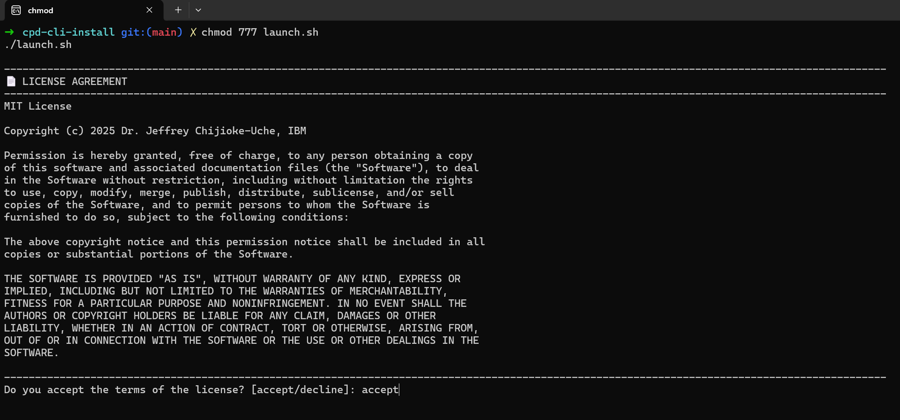
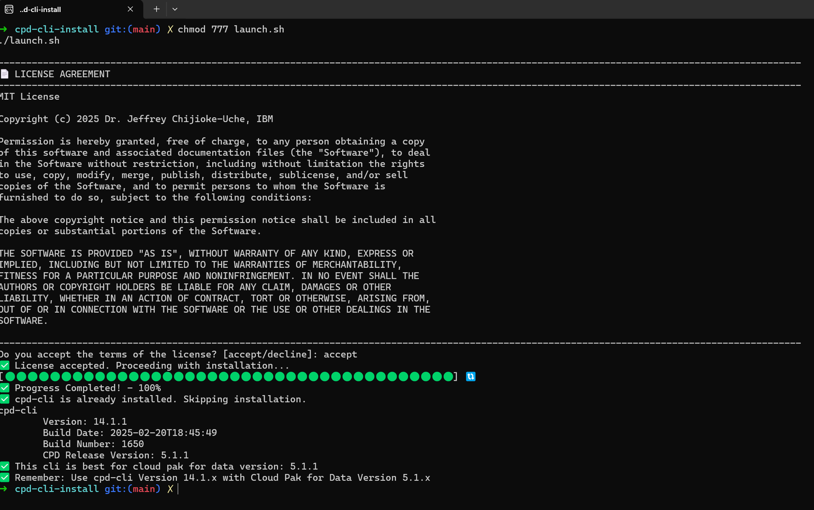
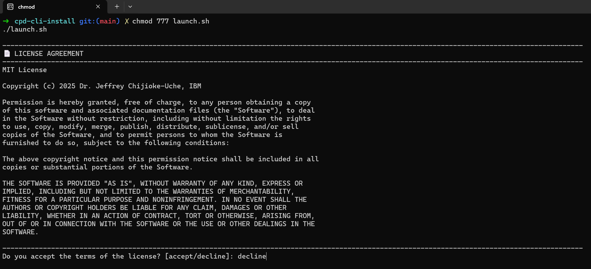
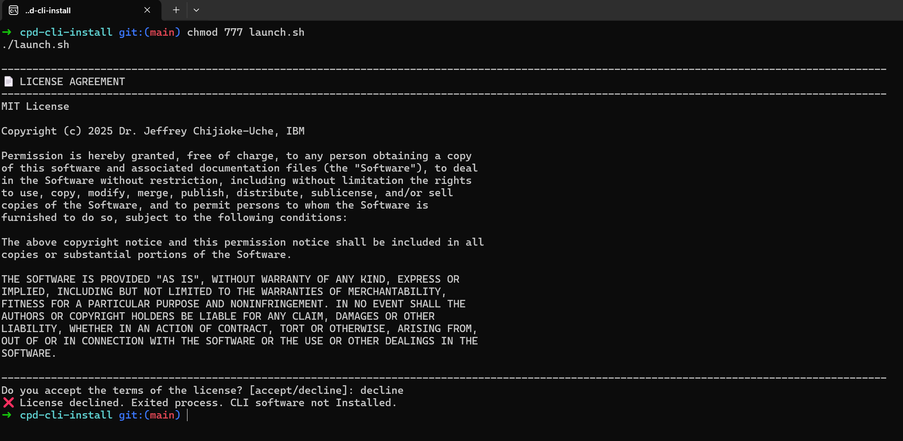

### IBM Software Hub CLI Installation

The script allows you to install the ibm-software-hub-cli so that you can complete administrative tasks on your Red Hat® OpenShift® Container Platform cluster for any IBM watsonx service deployment.

Supported Operating Systems:
- RHEL 8.xx
- RHEL 9.xx
- CentOS 8.xx
- CentOS 9.xx
- Ubuntu 20.xx
- Ubuntu 22.xx
- Ubuntu 24.xx
- SLES 15.xx
- SLES 12.xx
- Windows - WSL2 (Windows Subsystem for Linux 2)
- MacOS - (with Homebrew installed)

### STEP 1: Clone the Toolkit
```sh
git clone https://github.ibm.com/JEFFREY-CHIJIOKE-UCHE/ibm-software-hub-cli-install.git
```

### STEP 2: Change to the root directory
```sh
cd ibm-software-hub-cli-install
```


### STEP 3: Launch the installtion (It will prompt you to accept the license)
```sh
chmod 755 launch.sh && ./xLaunch.sh
```

### Samples

#### Sample 1


#### Sample 2


#### Sample 3


#### Sample 4



-------------------
##### Author
###### © 2025 Dr. Jeffrey Chijioke-Uche, IBM Computer Scientist


